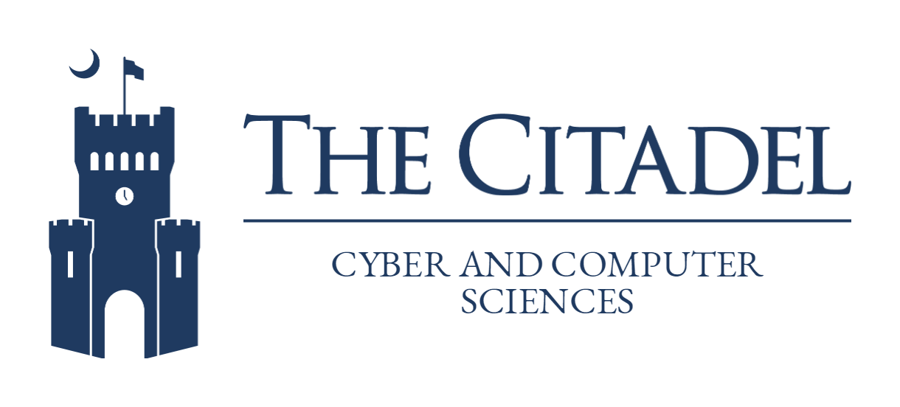

# Embedding Ethics in the CS Curriculum

The impact of ethics touches all aspects of computing, from the professional side populated by graduates of Computer Science programs, to the user side, populated by every type of person all over the world. It is critical that computing education prepare its students not only for ethical impacts in their careers, but also for the health of the Internet at world scale.

### The Department of Cyber and Computer Sciences

Our mission is to prepare students to meet the computing demands they will face in their careers and as knowledgeable citizens. Through academic programs, research, and public service the department supports the disciplines of cyber and computer science and the growth and development of educational opportunities in the Lowcountry.

